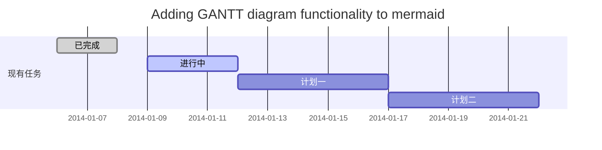
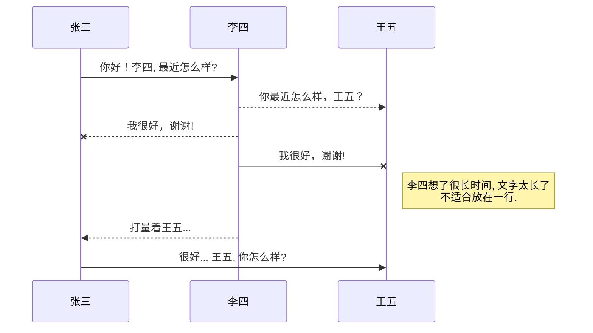
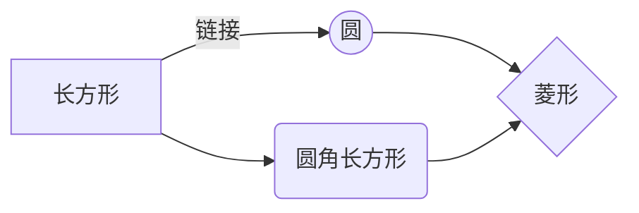

@[TOC](操作系统的发展历史)

openEuler是一个接CentOS工作的国产服务器操作系统，同时应用场景也在不断地丰富。
随着国产化的要求不断加大，作为一名能动专业小白，也要<font face="黑体" color="#db5079">接触openEuler操作系统</font>推进应用国产化进程了。
希望我的读书笔记能帮助的跟多人，话不多说，我开始敲了。
# 操作系统的发展历史
在这一节我用一了个下午的时间来初读，还是感触不少。

操作系统的产生与硬件系统的发展息息相关，随着计算机系统的技术发展不断的完善。为了更好的阐释，我们要先来了解操作系统的发展史。

## 手工操作时代
1946-1955，诞生了以ENIAC为代表的第一代计算机。

> 世界上第一台通用计算机“ENIAC”在美国宾夕法尼亚大学诞生。发明人是美国人莫克利（JohnW.Mauchly）和艾克特（J.PresperEckert）。

第一代计算机主要由真空管构成，计算速度慢，无操作系统，直接使用机器语言与硬件打交道。将程序与数据记录在纸带、卡片等介质上，通过输入设备（如纸带、卡片阅读机）载入计算机。然后通过控制台开关启动程序运行。计算完毕后输出计算结果，用户取走卸下纸带或者卡片。在手工操作时代，用户使用计算机都是预约制，当第一个用户使用计算机时，将独占全部的计算机资源，并在其使用完毕后根据预约时间，安排第二个用户使用。
  ```mermaid 
graph TD  
  A["将程序与数据记录在介质上"]  
  B["通过输入设备载入计算机"]  
  C["通过控制台开关启动程序运行"]  
  D["计算完毕后输出计算结果"]  
  E["用户取走卸下纸带或者卡片"]  
  A-->B  
  B-->C  
  C-->D  
  D-->E
  style A fill:#399AA2, stroke:#db5079
  style B fill:#399AA2, stroke:#1E5155
  style C fill:#399AA2, stroke:#399AA2
  style D fill:#db5079, stroke:#db5079
  style E fill:#399AA2, stroke:#db5079

  ```

在这个阶段，计算机对任务的处理为串行处理，计算效率极为低下。
## 批处理系统

20世纪，50年代，晶体管的出现极大的推动了计算机的计算性能和可靠性。
手工操作的低速和计算机的高速形成矛盾，唯一的解决方案是告别传统的人手操作，实现作业的自动过渡。在这种情况下，批处理系统出现了。
在批处理时代，程序员不再直接操作机器，配置了专门的计算机操作员来减少机器的错误。同时操作员将用户提交的作业进行批组合，编成作业执行序列，在送入计算机中进行处理。这种批处理方式称为联机批处理，实现了作业的自动转接，减少了总耗时中人工输入等待的时间。但在作业输入和输出过程中，CPU仍处在等待状态，资源利用率有待提升。

> 批处理系统是一种计算机操作系统，用户将一批作业提交给操作系统后就不再干预，由操作系统控制它们自动运行。这种采用批量处理作业技术的操作系统称为批处理操作系统。它分为单道批处理系统和多道批处理系统，不具有交互性。

因此在批处理系统时代的后期，为解决高速主


## 多道程序系统
多道程序系统是在计算机内存中同时存放几道相互独立的程序，使它们在管理程序控制下，相互穿插运行，两个或两个以上程序在计算机系统中同处于开始到结束之间的状态，这些程序共享计算机系统资源。与之相对应的是单道程序，即在计算机内存中只允许一个的程序运行。对于一个单CPU系统来说，程序同时处于运行状态只是一种宏观上的概念，他们虽然都已经开始运行，但就微观而言，任意时刻，CPU上运行的程序只有一个。
## 分时操作系统

*强调文本* _强调文本_


==标记文本==

~~删除文本~~


## 实时操作系统


居中的图片: 

# 操作系统的基本功能

去[博客设置](https://mp.csdn.net/console/configBlog)页面，选择一款你喜欢的代码片高亮样式，下面展示同样高亮的 `代码片`.
```javascript
// An highlighted block
var foo = 'bar';
```

# 操作系统的设计目标

- 项目
  - 项目
    - 项目

- [ ] 计划任务
- [x] 完成任务

# 主流的操作系统
一个简单的表格是这么创建的：
项目     | Value
-------- | -----
电脑  | $1600
手机  | $12
导管  | $1

## 终端操作系统

## 服务器操作系统

## 操作系统发展趋势

### 微内核


### 库操作系统

Markdown将文本转换为 HTML。

*[HTML]:   超文本标记语言

### 外内核 

您可以使用渲染LaTeX数学表达式 [KaTeX](https://khan.github.io/KaTeX/):

Gamma公式展示 $\Gamma(n) = (n-1)!\quad\forall
n\in\mathbb N$ 是通过欧拉积分

$$
\Gamma(z) = \int_0^\infty t^{z-1}e^{-t}dt\,.
$$

> 你可以找到更多关于的信息 **LaTeX** 数学表达式[here][1].

### 多内核 


- 关于 **甘特图** 语法，参考 [这儿][2],

### 离散化内核 

可以使用UML图表进行渲染。 [Mermaid](https://mermaidjs.github.io/). 例如下面产生的一个序列图：



这将产生一个流程图。:



- 关于 **Mermaid** 语法，参考 [这儿][3],

## FLowchart流程图

我们依旧会支持flowchart的流程图：
```mermaid
flowchat
st=>start: 开始
e=>end: 结束
op=>operation: 我的操作
cond=>condition: 确认？

st->op->cond
cond(yes)->e
cond(no)->op
```

- 关于 **Flowchart流程图** 语法，参考 [这儿][4].

 [1]: http://meta.math.stackexchange.com/questions/5020/mathjax-basic-tutorial-and-quick-reference
 [2]: https://mermaidjs.github.io/
 [3]: https://mermaidjs.github.io/
 [4]: http://adrai.github.io/flowchart.js/