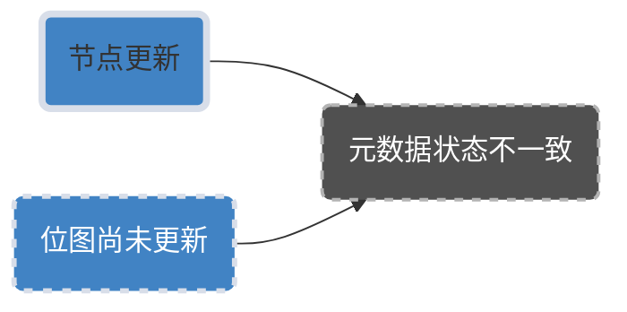
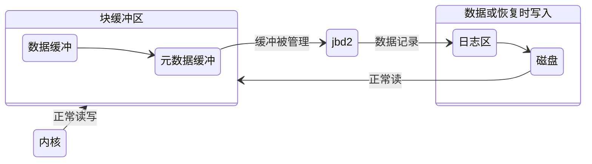

<10min速通FSCK、原子操作与VFS>
在不少的情况下，由于计算机软硬件或人为原因断电、**崩溃（crash）**，如果此时系统正在更新硬盘数据，则可能出现数据一致性问题——**崩溃一致性问题（crash-consistency problem）**

> 图1 数据块 索引点 位图关系

然而，磁盘在同一时间只能进行一次I/O操作，硬件层面无法实现，所以文件系统需要在**软件**层面**原子性**的从一个状态更新到一个新的状态。

本节将介绍两种解决方案：**文件系统检查器**和**日志**。
# 文件系统检查器
$$
File System Checker=FSCK
$$
文件系统检查器（File System Checker，FSCK）是解决崩溃一致性问题的一种简单方案。

主要用于**解决**由于各种原因导致的文件系统**不一致性**问题，例如系统崩溃、断电、文件系统损坏等。

在处理崩溃一致性问题时，FSCK提供了一种简单而有效的方法来检查和修复文件系统。当文件系统遭受损坏或出现不一致性时，FSCK可以**扫描整个文件系统**并检测到潜在的错误。一旦检测到错误，FSCK会尝试自动修复它们，以便文件系统恢复到一致状态。

使用FSCK可以确保文件系统的完整性，从而避免数据丢失或文件损坏。它通常在操作系统启动时自动运行，或者可以手动启动以检查特定的文件系统。

在openEuler中，这个工具被称为 **e2fsck**(以下简称FSCK) ，可以用来检测Ext2/3/4文件系统。

$$
e2fsck
$$

## 1.检查inode表
### 1) 遍历所有inode
这是检查inode表的第一步。inode是文件系统中的一个重要数据结构，用于存储文件或目录的元数据。遍历所有inode是为了检查它们的状态和完整性。
- 检查inode类型字段`i_mode`是否合法
- 检查inode记录的文件大小（`i_size_lo` 与` i_size_high`）
- 检查数据块是否被另一个inode重复引用
### 2) 修复多次引用数据块
如果一个数据块被多个inode引用，这可能会导致数据不一致或损坏。修复这种情况可以确保数据的一致性和完整性。
- 再次扫描所有inode指向的数据块
- 遍历文件系统树结构
- 对文件系统进行修复
## 2.检查目录结构
目录是文件系统中组织文件和子目录的方式。检查目录结构可以发现并修复任何目录相关的问题，例如丢失或重复的目录项。
- `rec_len` 的值至少为8B，并且不能大于该目录所在数据块中剩余空间大小
- `name_len` 值小于`rec_len-8`
- inode编号指定正在使用
- 目录第一项为`.`(当前目录)
- 目录第二项为`..`（父目录）
- 收集每个目录的inode编号
## 3.检查目录的连接
这涉及到检查目录项之间的连接关系，确保它们正确地链接在一起，没有断裂或循环引用。
###  1）检查根目录确保存在
### 2） 遍历所有目录的inode,有问题的连接到`/lost+found`
## 4.检查引用次数
在文件系统中，某些数据结构或数据块可能被多个地方引用。检查引用次数可以确保这些数据结构或数据块被正确地使用和释放，避免内存泄漏或其他问题。
 - [ ] 多数inode为未分配，引用次数为0
 - [ ]  已分配引用次数为1
 - [ ]  文件目录多链接引用次数大于1
## 5.检查位图一致性
位图是文件系统中用于跟踪空闲空间的数据结构。检查位图一致性可以确保文件系统能够正确地分配和回收空间。
- 非常耗时，特别是在检索文件系统中的所有索引节点
$$
Ext4
$$
- Ext4 对未分配的 inode 做了标记，使 FSCK在检查磁盘时将其整块的忽略掉，大大缩短磁盘检测时间

------
# 日志
$$
journaling
$$
**日志（journaling）机制**是现代文件系统（如Linux Ext3/Ext4、Windows NTFS）解决**崩溃一致性**问题的主流解决方案，借鉴于数据库系统的设计思想，日志系统将将文件系统的更新组织为**事务（transaction）**，使得文件系统的状态为完成或未完成，日志机制将文件系统的状态划分为三种状态：
- 1.日志的写入
- 2.事务的提交
- 3.检查点的添加

1. **日志的写入**：

	* 在日志机制中，每次对文件系统的修改都会首先被写入到一个专门的日志文件中。这个日志文件记录了所有的更改操作，包括数据的读、写、删除等。即对元数据（索引节点、位图等）和数据块做待做更新以日志形式写入磁盘。 实质上，日志是一个**无名字**的文件，对应**inode**号为**8** 
	* 这种写入操作确保了即使在系统突然崩溃的情况下，文件系统也可以通过这个日志来恢复到一致的状态。因为即使某些修改尚未完全应用到实际的文件系统中，它们在日志中仍然被记录下来，从而可以在恢复过程中重新应用。
2. **事务的提交**：
$$ 
transaction
$$
	* 在数据库管理中，一个事务是一系列的操作，这些操作要么全部成功，要么全部失败，以确保数据的一致性。在文件系统中，日志机制同样支持事务的概念。
	* 当一系列的修改操作被写入日志后，它们被组织成一个事务。只有当这个事务的所有修改都被成功记录到日志中时，才会被称为**事务已提交（committed）**，意味着这些修改现在可以被应用到实际的文件系统中。
	* 如果在事务提交之前系统崩溃，由于这些更改已经被记录在日志中，文件系统可以在重启后重新应用这些更改，确保数据的一致性。
3. **检查点的添加**：
$$
check point
$$
	*  检查点（check point）是在文件系统中的某一特定时间点，所有的事务都已经被提交的状态。在日志机制中，检查点起到了一个重要的作用，因为它标记了一个时间点，从那时起，即使发生崩溃，文件系统也可以从这个检查点开始恢复，而不是从头开始。
	* 当系统运行时，会定期添加检查点。这意味着如果系统在检查点之后崩溃，重启后恢复过程可以从这个检查点开始，而不是从头开始。这大大减少了恢复时间。

通过这三种状态的管理和操作，日志机制为现代文件系统提供了强大的崩溃一致性保护，确保了数据的完整性和可靠性。

